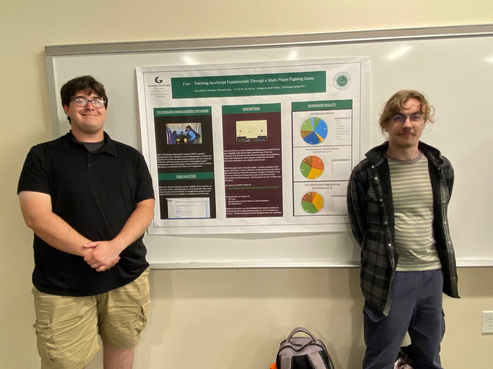

# Teaching JavaScript Fundamentals Through a MultiPlayer Fighting Game
## Description
* Difficulty Level: Intermediate
* Target Audience: High School - College
* Duration of Workshop: 2 hours
* Needed Materials: Computer, Internet Access, Visual Studio Code
* The goal of this project is to educate others about JavaScript basics while building a HTML/CSS webpage.
* Foes is a web-hosted project. This project is curated to peak the interest of non-IT and beginning IT majors.
By participating in the workshop, student will get to experiment with JavaScript, HTML, and CSS code to immediately view their changes on their browser.
* The Technology Ambassador Program ([TAP](https://www.ggc.edu/academics/school-of-science-and-technology/research-internships-service-learning/technology-ambassador-program)) at GGC strives to break the misconceptions of the IT field by providing fun workshops for students of all backgrounds. TAP students design engaging and fun outreach workshops to encourage interest in IT and STEM.

## Team
* Alex Shaklee
* Alec Burns
## Advisors
* Dr. Wei Jin
* Dr. Xu Xin   
### Team Photo
  
(Left: Alec Burns, Right: Alex Shaklee)  

## Publications
1. Alex Shaklee, Alec Burns, Wei Jin, Xin Xu. Foes - Teaching JavaScript Fundamentals Through a MultiPlayer Fighting Game, CREATE Symposium, April 25, 2023, Georgia Gwinnett College.
2. Alex Shaklee, Alec Burns, Wei Jin, Xin Xu. Foes: Sparking Programming Interest in Non-IT students Through a JavaScript Fighting Game. Extended Abstract and Poster Presentation, SIGITE 2023, October 2023, Kennesaw State University.

## Outreach Activities
1. Atlanta Science Festival, March 18, GGC - To promote IT field and the TAP program to college students and faculty
2. TAP EXPO, March 21, GGC - To promote IT field and the TAP program to college students and faculty
3. Atlanta Science Festival, March 25, Piedmont Park - To promote/introduce IT as a interest to K-12 children 
4. STARS, April 13, GGC - Presentation meant to peak interest in TAP and IT through the evaluation of survey results
5. Class Workshops - 

## Similar Projects
## Technology
 
(Visual Studio Code)  
This project will also use the following coding languages:   
(CSS Coding Sample) 
  
(JavaScript Coding Sample) 
  
(HTML Coding Sample) 
 

## Project Setup/Installation
### Description
Taking inspiration from the game ROUNDS on Steam, we set out to make a fighting game that creates a state of tug of war. While each layer starts off with equal power, each time a player loses a round they are offered a powerup. These powerups are randomly generated and stack with each other, meaning that winning too frequently often results in losing, which in turn powers up the former winner. The first player to win 5 rounds wins the game.
### Play Game
To find detailed instructions on how to play 'FOES' please click this link: [Play Foes Instructions](https://github.com/TAP-GGC/Foe/blob/main/Documents/Installation%20Instructions/Play%20Foes.pdf)

## Demo Videos
[Foes - Project Demo](https://youtu.be/TSae0OkMVps)  
[Foes - CodePen Introduction](https://youtu.be/RjTCXWFcRWk)  
[Foes - Workshop 1 (CodePen)](https://youtu.be/PY2kcPDk_fk)  
[Foes - Workshop 2 (CodePen)](https://youtu.be/zK28rMbyrcU)  
[Foes - Workshop 1 (Repo)](https://youtu.be/s5oirJfEOdY)  
[Foes - Workshop 2 (Repo)](https://youtu.be/zDPACQ05Vs0)

## Workshop Access 
There are two ways to access the Foes Workshops. The first way involves clicking a link to acccess CodePen: a website that allows users to edit/create basic webpages using HTML, CSS, and JavaScript. The second way involves downloading a copy of the entire Foes Project onto your personal computer and changing the code on a code editor app. This workshop will use Visual Studio Code. Please choose the method that works best for you and your classroom needs.
 
### Workshop 1 - CodePen
1. CodePen Workshop 1: [Workshop 1 - CodePen Access](https://codepen.io/Alreeshid/pen/xxyGwWp)
2. To get Workshop 1 Instructions, please click this link: [Foes - Workshop 1 PDF](https://github.com/TAP-GGC/Foe/blob/main/Documents/Workshop%20Instructions/CodePen%20Workshop%20Instructions/Foes-Workshop1.pdf)
4. To get a video walkthrough please click this link: [Foes - Workshop 1 (CodePen)](https://youtu.be/PY2kcPDk_fk)

### Workshop 2 - CodePen
1. To properly access Workshop 2 do not click the link provided at the bottom of the webpage as it will cause the layout of your coding environment to differ from the laid out PDF instructions. Instead use this link: [Workshop 2 - CodePen Access](https://codepen.io/Alreeshid/pen/wvYaKjw)
2. To get Workshop 2 Instructions, please click this link: [Foes - Workshop 2 PDF](https://github.com/TAP-GGC/Foe/blob/main/Documents/Workshop%20Instructions/CodePen%20Workshop%20Instructions/Foes-Workshop2.pdf)
3. To get a video walkthrough please click this link: [Foes - Workshop 2 (CodePen)](https://youtu.be/zK28rMbyrcU) to complete the workshop.

### Workshop 1 and 2 via Repo
Please follow the steps below to properly download and do the workshop: 
1. [Install Git](https://github.com/TAP-GGC/Foe/blob/main/Documents/Installation%20Instructions/Install%20Git.pdf) 
2. [Install Foes](https://github.com/TAP-GGC/Foe/blob/main/Documents/Installation%20Instructions/Install%20Foes.pdf)  
   Please note that the following instructions will explain a little about what cloning is, but this is not an in depth explanation. To learn more about cloning with Git please click the following links: [What is a repository?](https://docs.github.com/en/repositories/creating-and-managing-repositories/about-repositories) and [What is cloning?](https://docs.github.com/en/repositories/creating-and-managing-repositories/cloning-a-repository)  
3. [Install Visual Studio Code](https://github.com/TAP-GGC/Foe/blob/main/Documents/Installation%20Instructions/Install%20Visual%20Studio%20Code.pdf)
4. To start Workshop 1 through the PDF document please click this link: [Foes - Workshop 1 PDF](https://github.com/TAP-GGC/Foe/blob/main/Documents/Workshop%20Instructions/Repo%20Workshop%20Instructions/Foes-Repo-Workshop1.pdf), or follow this video [Foes - Workshop 1 (Repo)](https://youtu.be/s5oirJfEOdY) to complete the workshop.
5. To start Workshop 2 through the PDF document please click this link: [Foes - Workshop 2 PDF](https://github.com/TAP-GGC/Foe/blob/main/Documents/Workshop%20Instructions/Repo%20Workshop%20Instructions/Foes-Repo-Workshop2.pdf), or follow this video [Foes - Workshop 2 (Repo)](https://youtu.be/zDPACQ05Vs0) to complete the workshop.
